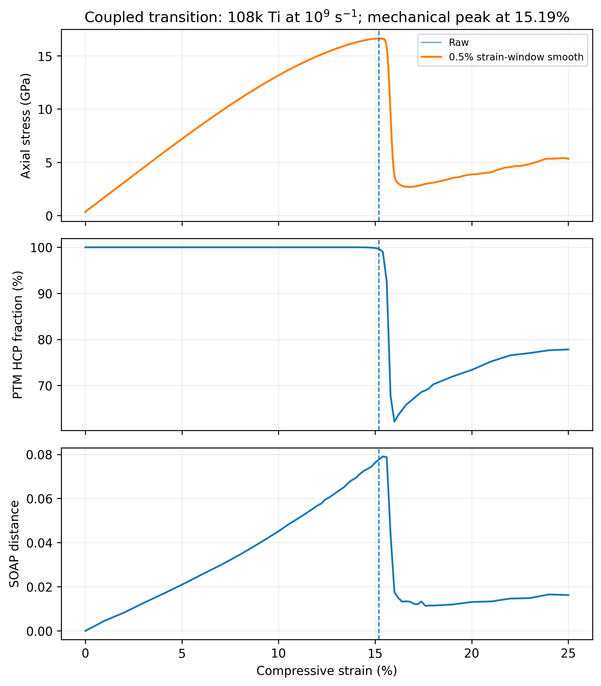
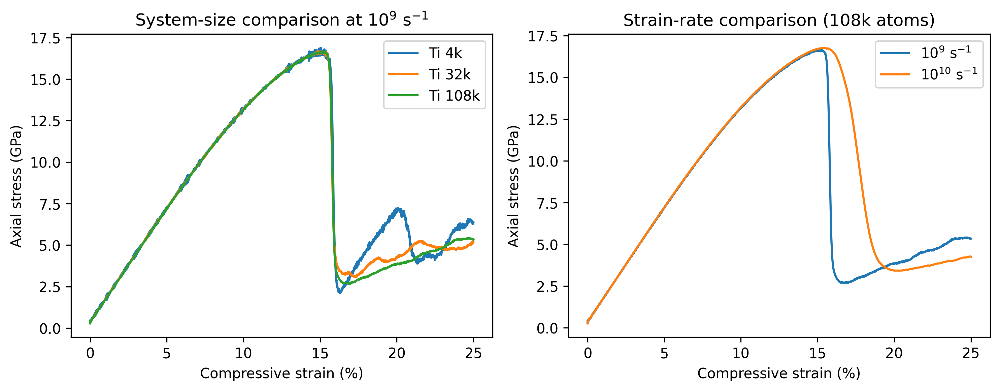
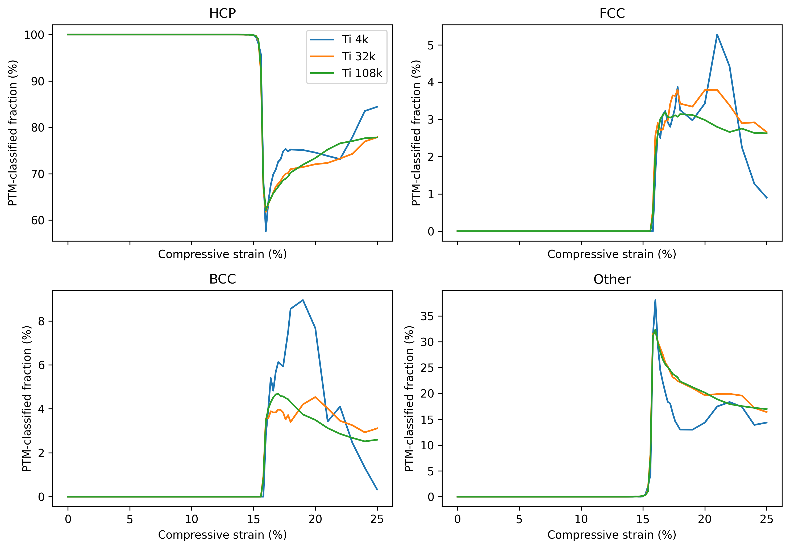
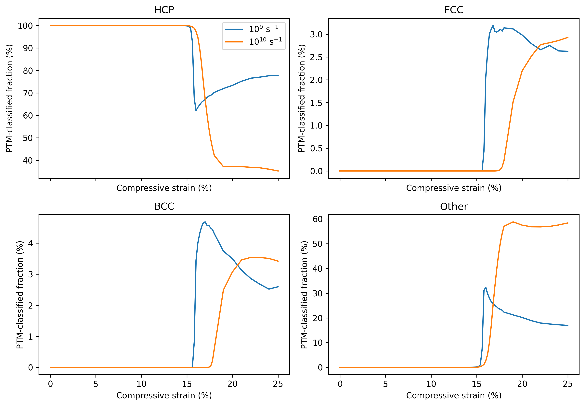
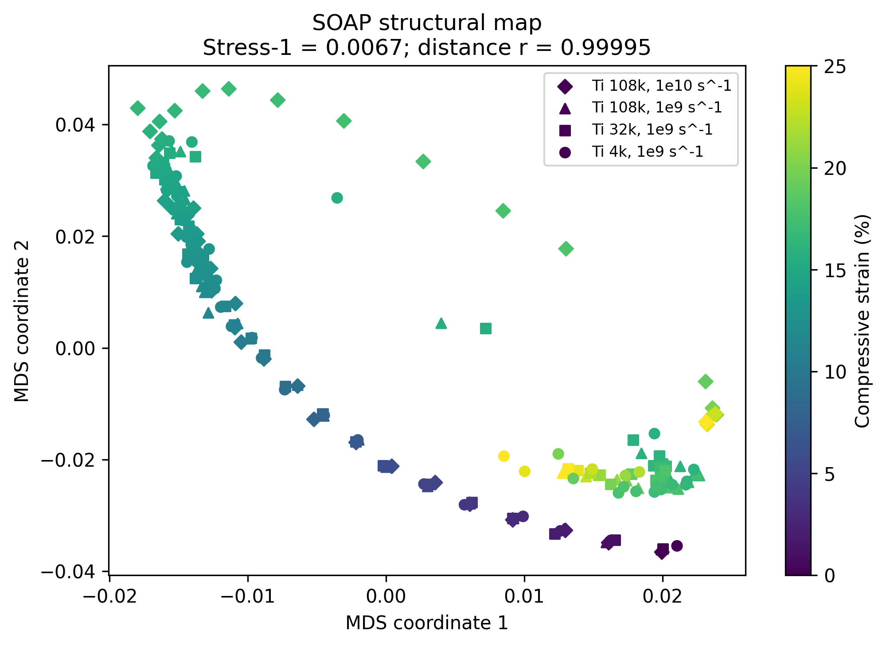
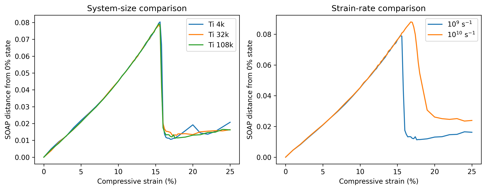
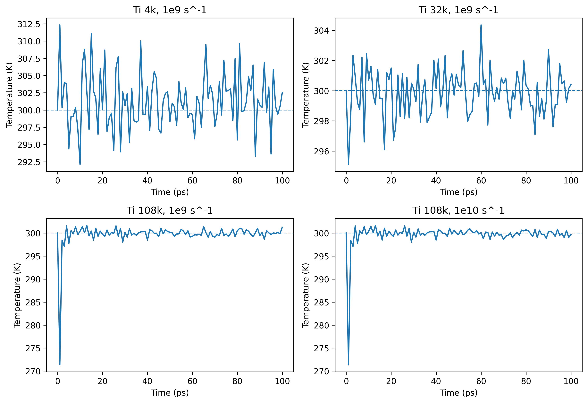
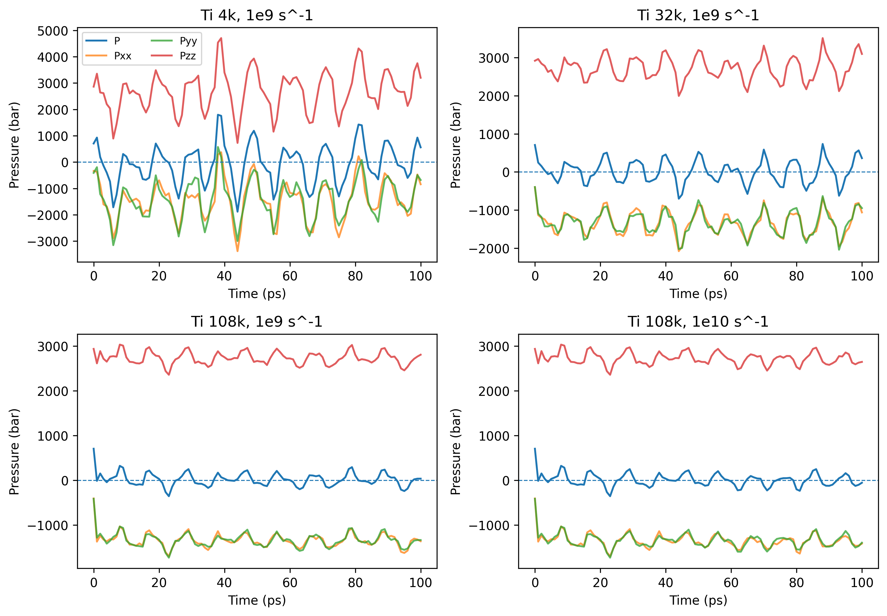
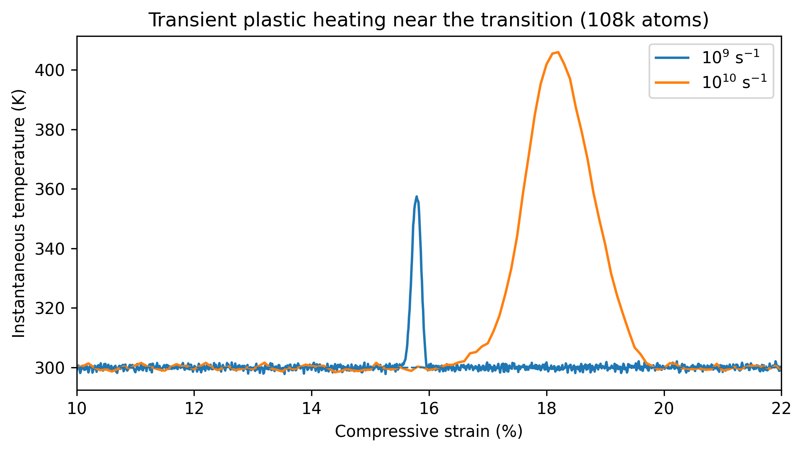
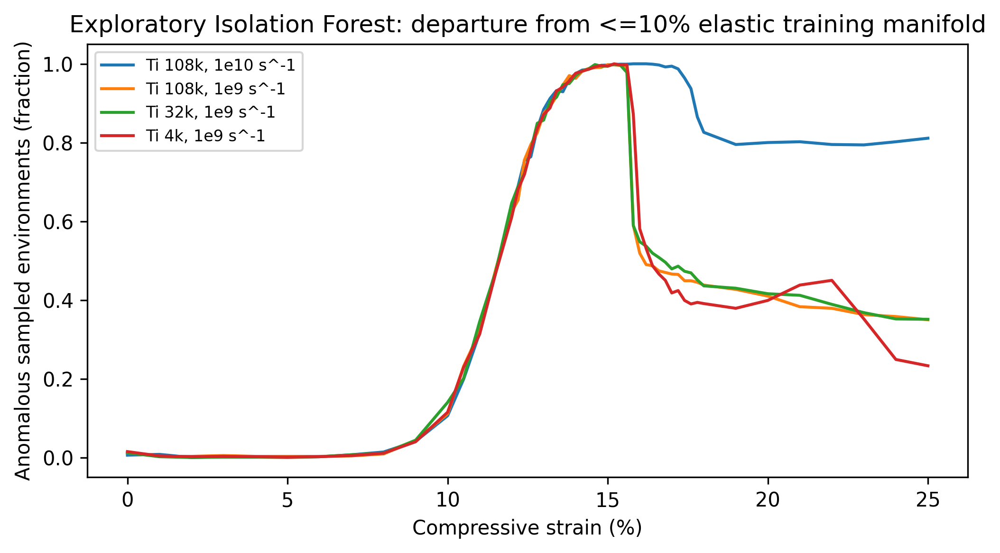

# Data-driven mapping of the elastic-to-plastic transition in HCP titanium

This repository combines **LAMMPS molecular dynamics**, **polyhedral template matching (PTM)**, and **SOAP structural descriptors** to track the atomic-scale structural transformation of defect-free HCP Ti during uniaxial **c-axis compression**.

The project contains four completed simulations: 4k, 32k, and 108k atoms at \($10^{9}\ \mathrm{s}^{-1}$\), plus a 108k rate-contrast case at \($10^{10}\ \mathrm{s}^{-1}$). All runs use the Kim-Lee-Baskes Ti 2NN-MEAM model, 300 K, periodic boundaries, 100 ps NPT equilibration, and loading to 25% engineering compression.

> **Central result:** the mechanical peak near 15% strain coincides with a sharp loss of HCP local order and a strong reorganization of SOAP descriptor space. The pre-transition response is almost size independent, while post-transition structure and stress fluctuations show clear size/rate dependence.



## Motivation and relationship to prior work

This repository is an independent research-portfolio study inspired by two recent directions in atomistic materials modelling.

Safari and Konstantinou (2026) investigated the size- and strain-rate-dependent deformation of crystalline HCP titanium under uniaxial compression using molecular dynamics, including systems extending to tens of millions of atoms. Mocanu, Elliott, and Konstantinou (2025) demonstrated the use of globally averaged SOAP descriptors together with multidimensional scaling (MDS) to construct configurational maps of structural evolution.

The present project combines these ideas at a smaller, reproducible scale. HCP Ti compression is characterized using conventional mechanical observables and polyhedral template matching (PTM), while SOAP descriptors and MDS are used to map the corresponding evolution through atomic-configuration space.

This repository is not intended as a full reproduction of either study. Instead, it demonstrates an integrated workflow connecting molecular dynamics, local-structure analysis, and descriptor-based materials informatics for studying the elastic-to-plastic transition in crystalline HCP Ti.

## Headline results

Mechanical peaks are extracted from a Savitzky-Golay curve whose window is defined in **strain space (~0.5% engineering strain)** rather than by a fixed number of output rows.

| Case | Atoms | Strain rate (s^-1) | Elastic slope, 2-10% (GPa) | Peak strain (%) | Peak stress (GPa) | Mean flow stress, 20-25% (GPa) |
|---|---:|---:|---:|---:|---:|---:|
| Ti 4k | 4,000 | 1e9 | 126.971 | 15.01 | 16.616 | 5.346 |
| Ti 32k | 32,000 | 1e9 | 127.004 | 15.09 | 16.609 | 4.847 |
| Ti 108k | 108,000 | 1e9 | 127.052 | 15.19 | 16.615 | 4.696 |
| Ti 108k | 108,000 | 1e10 | 127.251 | 15.40 | 16.767 | 3.805 |

Because these are ideal periodic single crystals at MD strain rates, the peak should be interpreted as a **defect-free mechanical instability / yield proxy**, not conventional engineering yield strength.

## 1. Mechanical response

At \($10^{9}\,\mathrm{s}^{-1}$), the three system sizes have nearly indistinguishable pre-peak response and peak stress (~16.61 GPa), but the post-peak response becomes progressively less noisy as the system grows. Increasing the rate to \($10^{10}\,\mathrm{s}^{-1}$\) shifts the 108k peak to ~15.4% and changes the subsequent relaxation path.



## 2. PTM local-structure evolution

PTM was evaluated with RMSD cutoff **0.15**. At \(10^9\;\mathrm{s^{-1}}\), clear HCP loss begins near 15.4% for all three sizes. At 25% strain, the 32k and 108k cases retain ~77.8% HCP, while the 4k cell shows stronger finite-size fluctuations. The high-rate 108k case retains only ~35.2% HCP and ~58.4% is classified as `Other` at 25%.

These are **local PTM template classifications**, not equilibrium bulk phase fractions.



The rate contrast is shown separately:



## 3. SOAP descriptor-space trajectory

For each saved frame, SOAP was evaluated for 1,000 persistent Ti atom IDs using periodic descriptors with `r_cut=5.0 Å`, `n_max=6`, `l_max=6`, and `sigma=0.5 Å`. Local vectors were averaged per frame and L2-normalized.

The combined two-dimensional MDS representation preserves the SOAP distance geometry extremely well:

- **Kruskal Stress-1 = 0.006706**
- **Pairwise-distance Pearson r = 0.999947**
- **208 total frames**



The descriptor distance from the equilibrated 0% reference increases during elastic compression, then reorganizes sharply through the transition. For the 108k cell, at 16% strain the SOAP distance is ~0.0175 at \(10^9\;\mathrm{s^{-1}}\) but ~0.0831 at \(10^{10}\;\mathrm{s^{-1}}\), reflecting the delayed structural path at the higher rate.

**Important:** SOAP distance here is a descriptor-space distance from the 0% reference; it is **not** a monotonic disorder parameter. Affine elastic strain contributes substantially before the transition.



## 4. Equilibration and nonequilibrium diagnostics

Temperature is stable around the 300 K target during the 100 ps equilibration. Fluctuations decrease with system size.



The simulations used **isotropic NPT** equilibration. Consequently, the mean/hydrostatic pressure is driven toward the target while the diagonal pressure components need not individually vanish in this anisotropic HCP cell. The final-20-ps hydrostatic means are approximately +263, +37.5, +0.3, and -14.3 bar for the 4k, 32k, 108k/1e9, and 108k/1e10 cases, respectively.



Plastic relaxation generates transient heating even though the simulations are thermostatted. In the 108k systems the temperature reaches ~357 K near 15.79% strain at \(10^9\;\mathrm{s^{-1}}\) and ~406 K near 18.2% strain at \(10^{10}\;\mathrm{s^{-1}}\). Therefore the rate comparison should be interpreted as a nonequilibrium rate response that includes different transient plastic-heating histories.



## 5. Exploratory anomaly analysis

An Isolation Forest was trained only on 32k local SOAP environments at strain <=10% and evaluated on the other trajectories. The model begins labeling high-strain *elastic* configurations as out-of-distribution before the mechanical transition, so this result is retained only as an **exploratory elastic-manifold extrapolation test**. It is **not** used as evidence of a validated plastic precursor detector.



## Simulation matrix

| Folder | Atoms | Strain rate | Loading steps | Target strain |
|---|---:|---:|---:|---:|
| `01_Ti4k_1e9` | 4,000 | 1e9 s^-1 | 250,000 | 25% |
| `02_Ti32k_1e9` | 32,000 | 1e9 s^-1 | 250,000 | 25% |
| `03_Ti108k_1e9` | 108,000 | 1e9 s^-1 | 250,000 | 25% |
| `04_Ti108k_1e10` | 108,000 | 1e10 s^-1 | 25,000 | 25% |

Common settings:

- HCP orientation: H1=[10-10], H2=[1-210], H3=[0001]
- loading direction: z=[0001] (c-axis)
- periodic x/y/z boundaries
- 1 fs timestep
- 300 K
- 100 ps isotropic NPT equilibration at target hydrostatic pressure 0 bar
- x/y barostatted during z compression
- Kim-Lee-Baskes (2006) Ti 2NN-MEAM potential

## Repository layout

```text
.
├── README.md
├── requirements.txt
├── figures/                       # Main and diagnostic figures
├── results/                       # CSV tables + results_summary.xlsx
├── postprocessing/                # Mechanical, PTM, SOAP, MDS and figure scripts
├── simulations/
│   ├── 01_Ti4k_1e9/
│   ├── 02_Ti32k_1e9/
│   ├── 03_Ti108k_1e9/
│   └── 04_Ti108k_1e10/
│       ├── in.ti_compression.lmp
│       ├── metadata.json
│       ├── output/                # Scalar outputs + compact production log
│       ├── post/                  # Processed mechanics/PTM/SOAP products
│       └── states/                # Equilibrated and final LAMMPS data files
├── structures/                    # Original HCP Ti data files
├── potentials/                    # MEAM files + original provenance/license metadata
└── docs/                          # Audit, limitations and data inventory
```

## Reproducing the existing figures without rerunning MD

Create a Python environment and install dependencies:

```bash
python3 -m venv .venv
source .venv/bin/activate
pip install -r requirements.txt
```

Then:

```bash
cd postprocessing
python3 01_mechanics.py
python3 04_build_soap_map.py
python3 06_make_figures.py
python3 07_build_summary_workbook.py
```

This uses the included scalar mechanics/equilibration data, PTM tables, and global SOAP descriptors.

## Recomputing the full atomistic analysis from scratch

Run the LAMMPS jobs first. For one CUDA/KOKKOS GPU:

```bash
LMP_BIN=lmp_gpu ./run_all_simulations_serial_kokkos_3080ti.sh
```

The per-case GPU runners use:

```text
-k on g 1 -sf kk -pk kokkos newton on neigh half neigh/thread off gpu/aware off
```

After trajectories have been regenerated:

```bash
cd postprocessing
python3 00_validate_inputs.py
python3 01_mechanics.py
python3 02_ptm.py
python3 03_soap.py
python3 04_build_soap_map.py
python3 06_make_figures.py
python3 07_build_summary_workbook.py
```

The optional Isolation Forest additionally requires `soap_local_samples.npz`, which `03_soap.py` creates from the regenerated trajectories.

## Why raw trajectories are not committed

The repository intentionally excludes raw `trajectory.lammpstrj`, restart binaries, and local-SOAP sample arrays. The 108k trajectories are ~178 MB each, above GitHub's 100 MiB regular-file limit, and the 32k trajectory is ~52 MB. All inputs needed to regenerate those files are included. Selected equilibrated/final `.data` structures and all processed evidence underlying the figures are retained, so no external Drive folder is required.

See [`docs/DATA_INVENTORY.md`](docs/DATA_INVENTORY.md) for the exact inclusion policy.

## Key limitations

- One trajectory per size/rate condition; no stochastic-replica uncertainty is claimed.
- Ideal periodic single crystals; no pre-existing dislocations, grain boundaries, surfaces, or alloy chemistry.
- Very high MD strain rates relative to most experiments.
- PTM and SOAP are complementary structural descriptors and require interpretation; neither is itself a direct thermodynamic phase-fraction measurement.
- The high-rate trajectory experiences a larger transient temperature excursion during the plastic event.

A detailed audit is in [`docs/AUDIT_AND_LIMITATIONS.md`](docs/AUDIT_AND_LIMITATIONS.md).

## References and provenance

1. F. Safari and K. Konstantinou, *Uniaxial compression of crystalline HCP titanium: an atomistic modelling study of size effects*, arXiv:2606.28155 (2026). https://arxiv.org/abs/2606.28155
2. F. C. Mocanu, S. R. Elliott, and K. Konstantinou, *Partial Melting and Structural Disorder in Models of Irradiated Amorphous Ge2Sb2Te5*, Phys. Status Solidi RRL 19, 2500037 (2025). DOI: 10.1002/pssr.202500037
3. Y.-M. Kim, B.-J. Lee, M. I. Baskes, *Modified embedded-atom method interatomic potentials for Ti and Zr*, Phys. Rev. B 74, 014101 (2006). https://doi.org/10.1103/PhysRevB.74.014101
4. NIST Interatomic Potentials Repository / OpenKIM model metadata: `MEAM_LAMMPS_KimLeeBaskes_2006_Ti__MO_472654156677_001`. https://www.ctcms.nist.gov/potentials/entry/2006--Kim-Y-M-Lee-B-J-Baskes-M-I--Ti/
5. LAMMPS documentation: https://docs.lammps.org/
6. OVITO PTM documentation: https://www.ovito.org/manual/reference/pipelines/modifiers/polyhedral_template_matching.html
7. DScribe SOAP documentation: https://singroup.github.io/dscribe/latest/tutorials/descriptors/soap.html
8. P. Hirel, *Atomsk: A tool for manipulating and converting atomic data files*, Computer Physics Communications **197**, 212–219 (2015). DOI: 10.1016/j.cpc.2015.07.012.

The original potential-model license and provenance files are preserved under `potentials/`. See [`THIRD_PARTY_NOTICE.md`](THIRD_PARTY_NOTICE.md).
